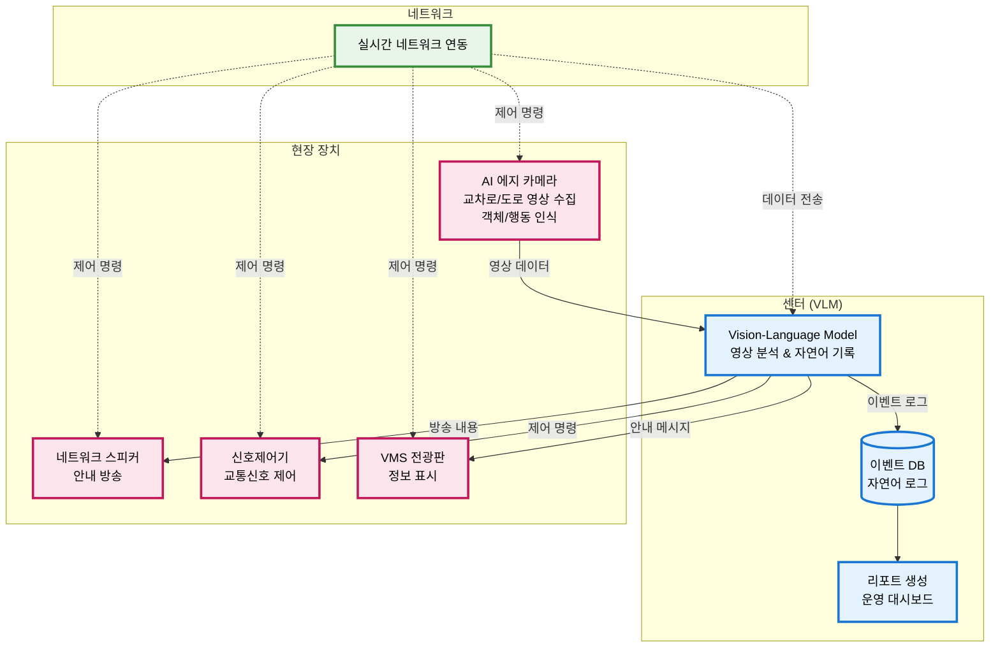

# 지능형 교통 관리 시스템 (VLM 기반) 구성 분석

**문서 작성일**: 2025년 8월 8일  
**분석 대상**: VLM(Vision-Language Model) 기반 교통 관리 시스템

## 🔹 시스템 구성 요소

### 센터 (VLM: Vision-Language Model)
- **역할**: 영상·스냅샷 기반 이벤트 분석 및 자연어 기록
- **기능**: 
  - 실시간 영상 분석
  - 이벤트 요약 및 자연어 기술
  - 통합 운영 관리
  - 리포트 자동 생성

### 현장 장치
1. **AI 에지 카메라**
   - 교차로/도로 영상 수집
   - 1차 객체/행동 인식
   - 실시간 이벤트 탐지

2. **네트워크 스피커**
   - 상황 발생 시 안내 방송
   - 보행자/운전자 대상 경고

3. **신호제어기**
   - 교통신호 제어
   - 센터와 연동하여 적응형 신호 제어

4. **VMS (전광판)**
   - 운전자/보행자 대상 정보 표시
   - 실시간 교통 상황 안내

### 네트워크 연동
- 모든 장치가 네트워크 기반으로 센터와 연동
- 실시간 데이터 전송 및 제어 명령 수신

## 🔹 시스템 구성도



## 🔹 주요 기능 분석

### 1. 교통사고 검지 및 대응

#### 워크플로우
```
AI 에지 카메라 → 사고 장면 자동 탐지
     ↓
센터 VLM → 사고 상황 요약 분석
     ↓
VMS → 실시간 안내 표시
스피커 → 안전 안내 방송
신호제어기 → 우회 신호 패턴 전환
```

#### 탐지 대상
- 충돌 사고
- 정차 차량
- 도로 장애물
- 부상자 발생

#### 대응 조치
- VMS: "전방 교통사고, 2차로 차단" 안내
- 스피커: 보행자/운전자 안전 안내
- 신호제어기: 사고 구간 회피 우회 신호 패턴

### 2. 교통신호 위반 검지

#### 기능
- AI 카메라: 신호위반 차량 자동 탐지 (적색 신호에서 진행)
- VLM: 이벤트 로그 기록 ("차량 A, 14:32, 적색신호 위반")
- 향후 경찰·지자체 과태료 부과 근거로 활용

### 3. 장치·신호기 장애 검지

#### 탐지 대상
- 신호등 불점등/점멸
- 장치 고장 상태

#### 대응
- VLM: "교차로 3, 북쪽 신호기 적색 불점등 고장" 기록
- 운영자 장애 알림 발송
- 네트워크 스피커/VMS로 안내 ("신호기 고장, 주의 운전")

### 4. 교통 혼잡 및 패턴 분석

#### 분석 항목
- 차량 흐름 측정
- 대기행렬 분석
- 평균 속도 측정

#### 활용
- VLM: "출근 시간대 3번 교차로 평균 지체 120초" 자연어 리포트
- 신호제어기 연계: 실시간 적·녹 시간 조정 (Adaptive Signal Control)

### 5. 위험 상황 안내/경고

#### 보행자 사고 위험 감지
- 무단횡단 등 위험 상황 탐지
- 스피커: "보행자 주의, 차량 접근 중" 즉시 경고
- VMS: "횡단금지, 차량 진행 중" 안내

#### 공사구간/돌발 상황
- VLM: 현장 상황 요약
- 자동 VMS 표출

### 6. 통합 운영 및 리포팅

#### 자연어 기록
- 센터 VLM: 영상+이벤트를 자연어로 요약
- 예: "2025-09-02 08:13, ○○교차로에서 2대 충돌, 우회전 차로 정체 발생"

#### 검색 및 리포트
- 자연어 검색: "오늘 오전 사고" → 관련 이벤트 조회
- 주간/월간 리포트 자동 생성:
  - 사고 발생 횟수
  - 신호위반 건수
  - 장애 건수

## 🔹 기대 효과

### 1. 자동 검지 → 빠른 대응
- 사고, 위반, 장애 상황의 즉시 탐지
- 자동화된 대응 시스템으로 대응 시간 단축

### 2. 현장 경고 → 2차 사고 예방
- 스피커, VMS를 통한 실시간 안내
- 사고 위험 상황 조기 경고

### 3. 신호 연동 → 교통 흐름 개선
- 적응형 신호 제어로 교통 효율성 향상
- 실시간 교통 상황 반영

### 4. 자연어 기록 → 운영 효율화
- 직관적인 검색 및 리포트 시스템
- 운영자 업무 효율성 향상

## 🔹 확장 가능성

### 단순 감시 시스템 → 지능형 교통 관리 플랫폼
1. **지능형 교통 관리**: AI 기반 실시간 교통 최적화
2. **자동 경고/안내**: 다중 매체를 통한 종합 안전 시스템
3. **운영 효율화**: 자연어 기반 직관적 운영 인터페이스

### 향후 확장 방향
- 머신러닝 기반 교통 패턴 예측
- IoT 센서 네트워크 확장
- 클라우드 기반 대규모 교통 관리 시스템
- 자율주행차와의 연동 시스템

---

**분석 완료일**: 2025년 8월 8일  
**분석자**: Claude AI Assistant
